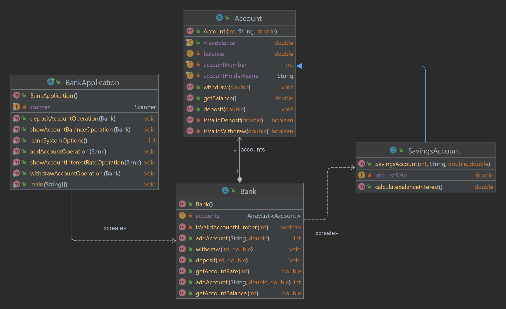

## Task1 - OOP

#### Task:
Create a banking application that allows customers to open a savings account, deposit and withdraw money, and view their balance.

#### The application should have the following classes:
- Account: A superclass that contains the account number, account holder name, and balance fields. It should also have a constructor that initializes these fields, and methods for depositing and withdrawing money.
- Savings Account: A subclass of Account that includes an interest rate field and a method for calculating interest on the balance.
- Bank: A class that stores an array of Account objects and has methods for adding new accounts, depositing and withdrawing money from accounts, and displaying the balance of a specific account.
- BankApplication: A class that contains the main method and allows customers to interact with the banking application through a command line interface.

#### Diagram
