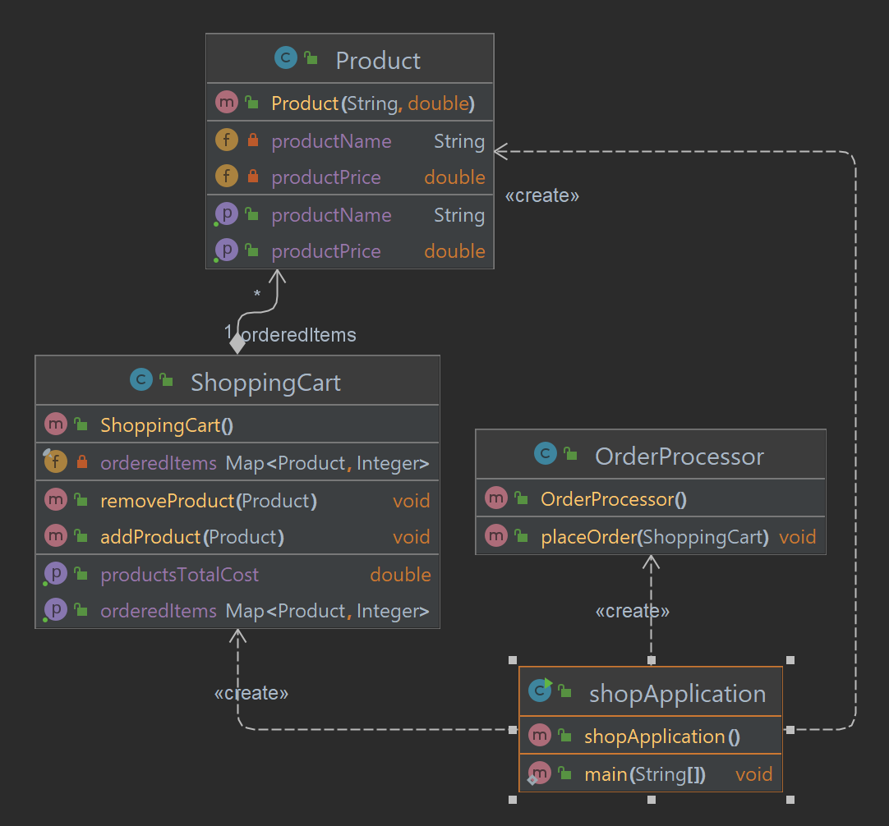

## Task2 - OOP

#### Online Shop:
- Develop a simplified online shop system where users can add products to a shopping cart, view the total cost, and place an order.
- You can define classes for product, shopping cart, and order processing.

#### The application should have the following classes:
- define the Product class to represent individual products. Each product has a name and a price.
- define the ShoppingCart class to manage the shopping cart functionality.
  It should have methods to add and remove items, calculate the total cost, and retrieve the items in the cart.
- define the OrderProcessor class to handle order processing.
  It should have a placeOrder method,
  Actually in this method we should have a big logic. But now in our example, please simply print the order details (each item and price) and total cost for the cart.
- In the main method, we create some sample products, create a shopping cart, add products to the cart, and then display the total cost. Finally, we create an instance of OrderProcessor and use it to place the order, which will print the order details.

#### Diagram

#### Resources
[java-oops-concepts](https://www.javatpoint.com/java-oops-concepts)